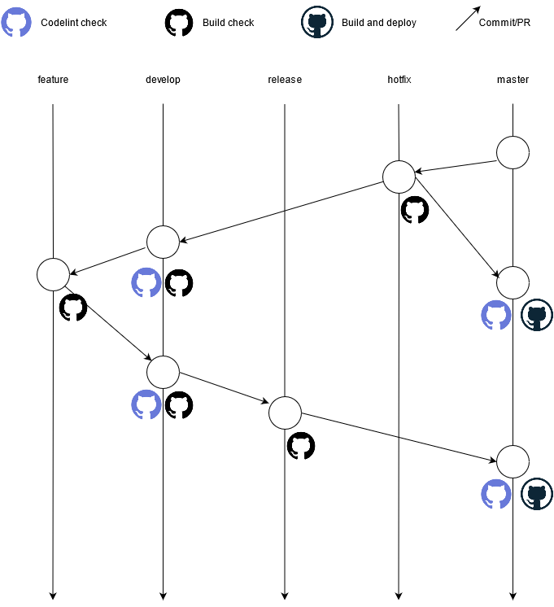

# Github Actions

## Github action for this project is divided into 3 major jobs
1. build-check.yml
    - Name: Build test pipeline
    - Objectives:
        - Test build by compiling project for release, feature and hotfix branches

2. codeql-analysis.yml
    - Name: CodeQL
    - Objectives:
        - Execute code quality check on project using codeql

3. dev-env-cicd.yml
    - Name: CI-CD pipeline
    - Objectives:
        - Build project
        - Upload to maven repo
        - Fetch artifact name
        - Upload artifact to server

4. prod-env-cicd.yml
    - Name: CI-CD pipeline
    - Objectives:
        - Build project
        - Upload to maven repo
        - Fetch artifact name
        - Upload artifact to server

## Github action triggers and flow 

1. The first check on any non `main(master, develop)` branch will be the build compile check which will be executed by `Build test pipeline`
    
    - Triggers: push on branches with below regex:
        - feature/**
        - release/**
        - hotfix/**
    
    - Steps:
    
        - Set up JDK 11
        - Checkout repository
        - Setup maven directory
        - Create extentions xml
        - Compile product

2. On commiting or creating PR to `main(master, develop)` branch will trigger code lint check which will be executed by `CodeQL` pipeline

    - Triggers: Push or PR on
        - master
        - develop

    - Steps:
        
        - Checkout repository
        - Initialize CodeQL
        - Autobuild
        - Perform CodeQL Analysis

3. On commiting to `develop` branch CICD job will be triggered which will build product and push artifact to develop server.

    - Triggers: Push to develop

    - Steps:

        - Set up JDK 11
        - Checkout repository
        - Setting.xml configuration
        - Setup maven directory
        - Create extentions xml
        - Configure AWS credentials
        - Generate and publish build
        - Retrieve jarfile
        - Deploy the package to the remote server

