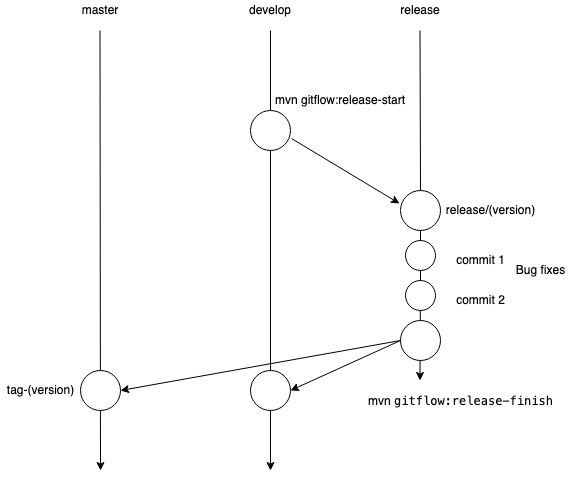
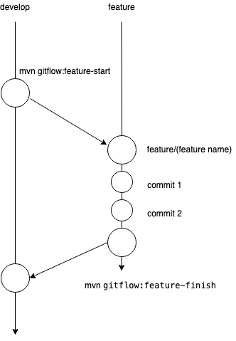
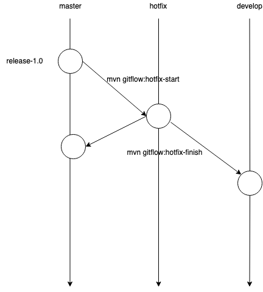

# Gitflow strategy


## The main branches 

- master
    - We consider `origin/master` to be the main branch where the source code of HEAD always reflects a production-ready state.
- develop
    - We consider `origin/develop` to be the main branch where the source code of HEAD always reflects a state with the latest delivered development changes for the next release. Some would call this the `integration branch`. This is where any automatic nightly builds are built from.

## Supporting branches

- Feature branches
    - May branch off from:
        - develop 
    - Must merge back into:
        - develop 
    - Branch naming convention:
        - anything except master, develop, release/*, or hotfix/*
    - Feature branches (or sometimes called topic branches) are used to develop new features for the upcoming or a distant future release. 

- Release branches
    - May branch off from:
        - develop
    - Must merge back into:
        - develop and master
    - Branch naming convention:
        - release/* 
    - Release branches support preparation of a new production release. They allow for last-minute dotting of i’s and crossing t’s. Furthermore, they allow for minor bug fixes and preparing meta-data for a release (version number, build dates, etc.). By doing all of this work on a release branch, the develop branch is cleared to receive features for the next big release.

- Hotfix branches
    - May branch off from:
        - master
    - Must merge back into:
        - develop and master
    - Branch naming convention:
        - hotfix/* 
    - When a critical bug in a production version must be resolved immediately, a hotfix branch may be branched off from the corresponding tag on the master branch that marks the production version.

# Gitflow integration for java maven plugin
1. Install gitflow plugin

```xml
<plugin>
    <groupId>com.amashchenko.maven.plugin</groupId>
    <artifactId>gitflow-maven-plugin</artifactId>
    <version>1.16.0</version>
    <configuration>
    <installProject>false</installProject>
    <verbose>false</verbose>
    <gitFlowConfig>
        <productionBranch>master</productionBranch>
        <developmentBranch>develop</developmentBranch>
        <featureBranchPrefix>feature/</featureBranchPrefix>
        <releaseBranchPrefix>release/</releaseBranchPrefix>
        <hotfixBranchPrefix>hotfix/</hotfixBranchPrefix>
        <origin>origin</origin>
    </gitFlowConfig>
    <commitMessages>
        <!-- since 1.2.1, see Customizing commit messages -->
    </commitMessages>
    </configuration>
</plugin>
```

# How to use gitflow-maven-plugin?

1. How to work with release?
    - Start release
        - `mvn gitflow:release-start` 
        - Given goal will create release branch and update version in develop branch with latest release.
        - Starts a release branch and updates version(s) to release version.
        - New release version will be updated in develop branch and release/(release_version) branch will be created from develop branch.

    - Finish release
        - `mvn gitflow:release-finish` 
        - Given goal will finish release branch development and update develop branch with release branch changes.
        - Merges a release branch and updates version(s) to next development version.
        - develop and master branch will get latest code from release branch and release branch will be deleted.
        - tags with release version will be created on master branch.
    
    - Release from develop branch
        - `mvn gitflow:release` 
        - Releases project without creating a release branch.
        - Develop will be merged with master and tag will be created for latest release.

    

2. How to work with feature branch?
    - Start feature
        - `mvn gitflow:feature-start` 
        - Starts a feature branch from develop and optionally updates version(s).

    - Finish feature
       - `mvn gitflow:feature-finish` 
       - Merges a feature branch to develop branch.
    
    

3. How to work with hot fix
    - Start hotfix
        - `mvn gitflow:hotfix-start` 
        - Starts a hotfix branch and updates version(s) to hotfix version.
    
    - Finish hot fix
        - `mvn gitflow:hotfix-finish` 
        - Merges a hotfix branch to develop and master.
    
    - Start hotfix from production tag
        - `mvn gitflow:support-start` 
        - Starts a support branch from the production tag.

    

4. Plugin help
    - `mvn gitflow:help` 
    - Displays help information.


## Refrences

- https://github.com/aleksandr-m/gitflow-maven-plugin
- https://guides.github.com/introduction/flow/
- https://nvie.com/posts/a-successful-git-branching-model/
